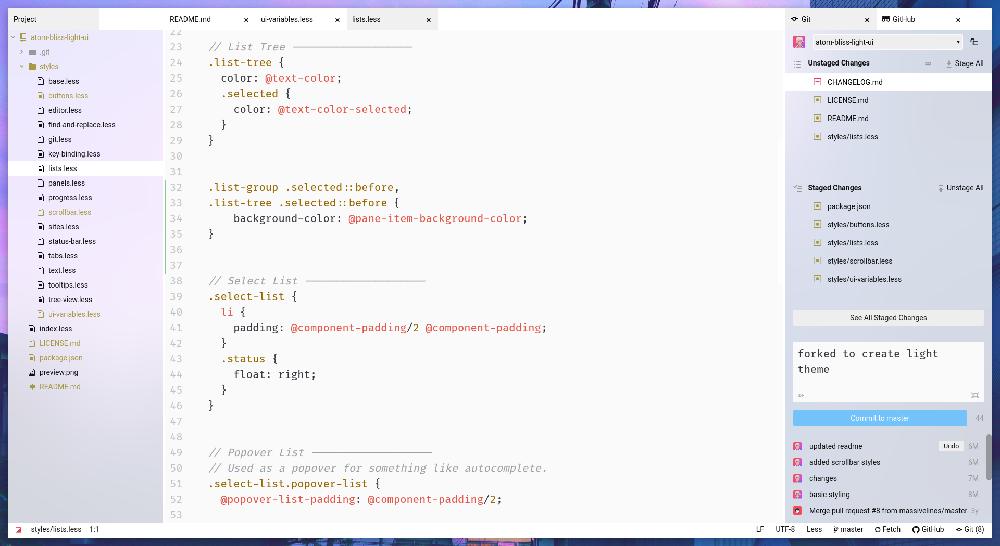

# Wave UI theme

A clean light theme for Atom. Parts of it are transparent which require you to modify the BrowserWindow object in Atom's source to take advantage of. Looks best with blurring which needs to be enabled in your environment's compositor.

[Check out the dark companion theme!](https://github.com/katacarbix/fang-ui)
